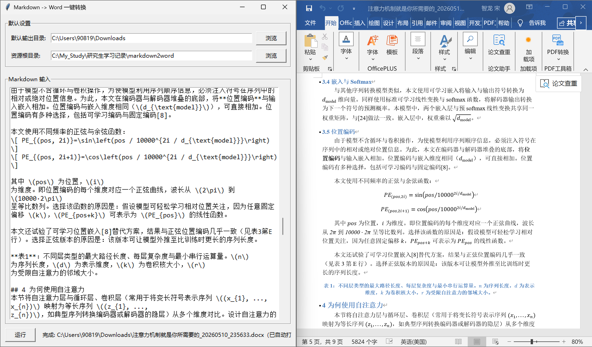

# Markdown2Word

一个基于 Python + Tkinter 的小工具，用于把 Markdown 文本快速转换为 Word 文档（`.docx`）。

项目提供了简单的图形界面，适合将ai的markdown格式的回答整理为word笔记、将ai翻译的论文转化为word文档等场景。当前实现重点放在中文文档排版、公式转换、图片与超链接处理，以及更符合中文写作习惯的段落输出效果。

## GUI 效果



## 目前支持

- 图形界面直接粘贴 Markdown 并导出 Word
- 标题、普通段落、粗体、斜体、下划线、代码块
- 表格、图片、超链接
- 行内公式与独占一行公式
- 独占一行的公式会单独成段并居中显示且不首行缩进
- 块公式居中显示
- 正文首行缩进2字符
- 一级标题居中显示
- 单独一行的“摘要”居中显示
- 独占一行的图片居中显示且不首行缩进
- 题注识别与居中
  - 例如 `表3：...`、`图2：...`、`Table 1: ...`、`表1 ...`、
- 有序列表按原文重新从 `1.` 开始
- 转换完成后自动尝试打开生成的 Word 文档（Windows / macOS / Linux 图形界面）
- setting.json中的
  - output_dir（输出目录），默认输出目录优先取用户的 Downloads，如果没有就尝试 下载，再不行就退回到用户主目录
  - asset_root（资源根目录），默认为当前工作目录，也就是你从哪里启动程序，默认资源根目录就指向哪里
  - title_chars（导出文件名截取的标题长度），默认是 12
  - auto_timestamp（是否自动在文件名后追加时间戳），默认是 True
  - body_first_line_indent（正文首行是否缩进），默认是 True

## 后续调优历程

  - 2026年5月11日——添加正文首行缩进开关、修改了列表中字体无法加粗显示的bug、优化了列表的缩进美观、完善对exe程序的读取配置规则
  - 2026年5月18日——针对豆包给的文本存在
    ```text
    ## 图1：实验结果对比
    我们的方法……
    ```
    识别为二级标题+文本而不能正确识别为图表标题的情况，代码添加了预处理阶段，将其合并为一个普通段落，再走 Caption 样式识别
  - 2026年5月24日——补充跨平台运行支持，生成完成后会按系统分别调用 Windows 默认打开方式、macOS `open` 或 Linux `xdg-open`
  - 2026年5月30日——图片插入格式居中、标题摘要居中、SVG 图片插入、资源根目录支持与markdown中的相对路径进行拼接再寻找图片等资源（适合存在多个资源目录的情况）也支持不与markdown中的相对路径进行拼接，直接定位资源根目录下的文件名（适合仅存在单个资源目录的情况）

## 适用场景

- 将 Markdown 笔记快速整理成 Word 文档
- 将ai帮忙完成的课程作业、实验报告、论文翻译稿从 Markdown 导出为 `.docx`
- 将ai回答的有用知识从 Markdown 导出为 `.docx`，方便整理笔记
- 将包含公式、图片、表格的中文技术文档转换为可继续编辑的 Word 文件

## 环境要求

- Python 3.10 及以上版本
- 带图形界面的 Windows、macOS 或 Linux 环境
- 电脑安装 Microsoft Office 并设为`.docx`的默认打开软件（wps打开的话公式阅读正常但可能复制粘贴格式会出问题）
- 推荐使用 conda 环境运行，Tkinter、Cairo 等底层依赖统一由 conda 管理
- 如果希望转换完成后自动打开文档
  - macOS 需要系统自带 `open`
  - Linux 需要桌面环境和 `xdg-open`
- SVG 图片会通过 `cairosvg` 自动转换为 PNG 后插入；如果转换失败，可以先手动把 SVG 转成 PNG/JPG

## 运行方式

Windows、macOS、Linux三种平台都推荐使用 conda 环境运行。`tk`、`cairosvg`、`cairo` 可以在创建环境时一次装好。

### 使用 base 环境（方便简单项目管理）

如果只是自己电脑上长期使用，可以直接在 conda 的 `base` 环境里安装依赖并运行：

```bash
conda activate base
conda install -c conda-forge tk cairosvg cairo
pip install -r requirements.txt
python markdown2word.py
```

这种方式步骤更少，适合简单项目的统筹base管理，但会把本项目依赖安装到 `base` 环境中。如果希望环境更干净，建议使用下面的专用环境方式。

### 新建环境（环境更干净）

安装 Anaconda 或 Miniconda 后，在项目目录打开终端，执行：

```bash
conda create -n markdown2word python=3.10 pip tk cairosvg cairo -c conda-forge
conda activate markdown2word
pip install -r requirements.txt
python markdown2word.py
```

## 项目文件

```text
markdown2word.py          GUI 入口
converter.py              Markdown -> Word 核心逻辑
mml2omml.xsl              公式转换所需 XSLT
settings.json             本地默认配置
data/GUI_and_result.png   GUI 效果截图
data/app_icon.ico         程序图标
```

## 后续可扩展方向

- 支持更多 Markdown 扩展语法
- 支持自定义 Word 模板
- 支持更细致的段落、字体、页边距和标题样式控制
- 支持批量导入 Markdown 文件并自动导出

## 打包指令

### Windows exe

exe程序已经打包并放在 markdown2word 文件夹下

```bash
pyinstaller --noconfirm --clean --windowed --onefile --icon data/app_icon.ico --add-data "mml2omml.xsl;." --collect-data latex2mathml markdown2word.py
```

### macOS / Linux

注意 `--add-data` 的分隔符要改成 `:`，且打包过程需自己运行下述指令完成

```bash
pyinstaller --noconfirm --clean --windowed --onefile --add-data "mml2omml.xsl:." --collect-data latex2mathml markdown2word.py
```
