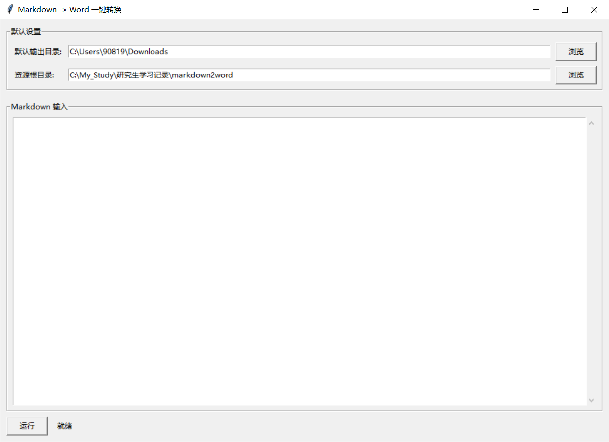

# Markdown2Word

一个基于 Python + Tkinter 的小工具，用于把 Markdown 文本快速转换为 Word 文档（`.docx`）。

## GUI 效果



## 目前支持

- 图形界面直接粘贴 Markdown 并导出 Word
- 标题、普通段落、粗体、斜体、下划线、代码块
- 表格、图片、超链接
- 行内公式与独占一行公式
- 块公式居中显示
- 正文首行缩进
- 题注识别与居中
  - 例如 `表3：...`、`图2：...`、`Table 1: ...`
- 有序列表按原文重新从 `1.` 开始
- 转换完成后自动打开生成的 Word 文档

## 运行方式

先安装依赖：

```bash
pip install -r requirements.txt
```

启动程序：

```bash
python app.py
```

## 项目文件

```text
app.py              GUI 入口
converter.py        Markdown -> Word 核心逻辑
mml2omml.xsl        公式转换所需 XSLT
settings.json       本地默认配置
data/GUI.png        GUI 截图
data/app_icon.ico   程序图标
```

## 打包为 exe

安装 `pyinstaller` 后，在项目根目录执行：

```bash
pyinstaller --noconfirm --clean --windowed --onefile --icon data/app_icon.ico --add-data "mml2omml.xsl;." app.py
```

生成后的可执行文件在：

```text
dist/app.exe
```

如果你想顺手把 `settings.json` 一起打进去，也可以用：

```bash
pyinstaller --noconfirm --clean --windowed --onefile --icon data/app_icon.ico --add-data "mml2omml.xsl;." --add-data "settings.json;." app.py
```

## 说明

- `mml2omml.xsl` 是公式转换必须文件，打包时一定要带上
- `settings.json` 不打包也能运行，程序会按默认配置启动
- `data/GUI.png` 只是 README 展示图片，不需要打包进 exe
